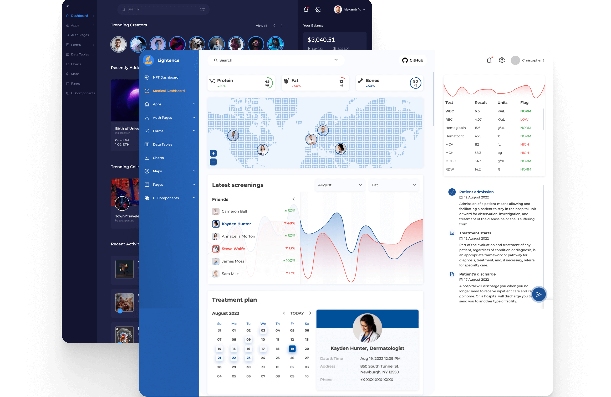

# Lightence

React-powered **100% FREE** Admin Dashboard Template for building rich user interfaces significantly faster. For developers of all levels. Open-source and maintained by the [Altence](https://altence.com) team.

<p align="center">
    
</p>

## Key Features
- 🚀 This solution allows you to reduce MVP development costs by up to 40%
- 🐜 Lightence admin dashboard template is based on a rich library powered by [Ant Design](https://ant.design/)
- 💰 100% Free: start using it for your projects right away. No hidden payments, no trials, nothing
- 💊 Medical dashboard includes: customizable medical dashboard for data-driven applications
- 🦸 Easy-to-start: check out a `starter` branch to skip demos and start building your next great project
- 💻 Any backend supported: the dashboard supports any kind of backend by just updating an API
- ⭐ Modern & great for projects of tomorrow: built with [React](https://reactjs.org/), [Redux](https://redux.js.org/) and [Ant Design](https://ant.design/); _Bootstrap_ and _jQuery_ 100% free
- 🇺🇳 Internationalized: built-in internationalization support
- 📱 Mobile first: optimized to reduce data usage on mobile devices
- 🔥 Responsive & adaptive: supports mobile, tablet, and desktop screens
- ☎️ Supports PWA to get all advantages of native mobile apps
- 🎨 Theming: use built-in light and dark themes or implement your own theme with just lines of code
- 🌓 Day & night mode: dark theme is automatically activated
- 🏋️ Optimized bundle size: use the latest features of building tools to reduce the final bundle size

## Under the Hood
- 💯 60+ ready-to-use customizable UI components
- 🚄 All-set business flow: login, sign up, forgot password, profile flows
- 🐝 Custom pages: 400 error, 500 error, profile
- 🗞️ Built-in apps: News Feed, Kanban
- 👍 Fully typescripted
- ✅ Clean code: enjoy the world-recognized code style with our own enhancements
- 🧱 Solid architecture: in compliance with the  best architectural practices
- 📃 [MIT](LICENSE) License

### Demo

Check out a [live demo](https://altence.com/lightence-admin-demo).

### Installation

#### Requirements
- [Node.js](https://nodejs.org/en/) version _>=16.0.0_
- [yarn](https://yarnpkg.com/)
- [git](https://git-scm.com/)

#### To go with the latest version please copy and past in your terminal the following steps

```
git clone https://github.com/altence/lightence-admin.git my-awesome-project && cd my-awesome-project
```

Development mode
```
yarn install && yarn start
```

Production mode
```
yarn install && yarn build
```

#### How to analyze the bundle size
```
yarn install && yarn build --stats
```

And then use the [webpack-bundle-analyzer](https://www.npmjs.com/package/webpack-bundle-analyzer) to open _build/bundle-stats.json_.

#### How to build your project based on Lightence

```
git clone -b starter https://github.com/altence/lightence-admin.git my-awesome-project && cd my-awesome-project
```
And you will see a demos-free template.

### Where to get help
[](mailto:lightence.admin@altence.com)
[](https://twitter.com/altence_team)
[](https://discord.gg/YBSrDrGe)
[](https://www.facebook.com/groups/altence)

### Contribution
Let’s create great products together! We encourage and welcome collaboration and any type of contribution. 👉 Learn the [contributing docs](CONTRIBUTING.md) on how to contribute the right way.

### Want to get popular?
If you use **Lightence** in your app development, please, let us know, and we’ll showcase your work to provide more awareness to your product.

### Components by request
As our admin system with a medical dashboard is fully customizable, we understand that you might need more components than it currently has. In case you didn't find a needed component inside Lightence, [contact us](mailto:lightence.admin@altence.com) to order it.

### How you can give a shout-out to us

- 🏗️ Make your disruptive products with Lightence
- ⭐ Star our GitHub repo
- 🐞 Create requests, submit bugs, suggest new features
- ☄️ Spread the word and share links about **Lightence** on social media
- 🔥 Follow us on [Twitter](https://twitter.com/altence_team) and [LinkedIn](https://linkedin.com/company/altence)

### Need developers’ help?
At [Altence](https://altence.com), we are always ready to get your feedback or give you advice if needed. We can also become your partner in development in case you need help with your projects. Drop us a line ([email](mailto:lightence.admin@altence.com)) and we’ll get back to you shortly.
